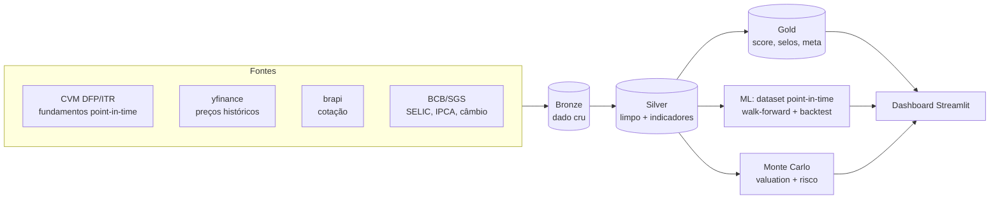

# Garimpo Alpha B3

> ⚠️ **Disclaimer:** projeto **educacional e de portfólio**. Não constitui recomendação de
> investimento. Resultados passados não garantem resultados futuros.

**Garimpo Alpha B3** é um otimizador de carteira de ações *data-driven* para a B3 que
"garimpa" oportunidades combinando **três camadas analíticas** sobre uma arquitetura de
dados moderna (Medallion). De ~50 ações líquidas, entrega um **ranking acionável** que une
**valor** (fundamentos), **probabilidade** (ML) e **risco** (Monte Carlo) — com total
transparência sobre como cada número é calculado.

O projeto demonstra, num produto coeso, os três papéis:

| Papel | O que demonstra |
|---|---|
| **Engenheiro de Dados** | Ingestão multi-fonte, arquitetura Bronze/Silver/Gold, dado *point-in-time*, pipeline reprodutível, CI |
| **Cientista de Dados** | Feature engineering, validação **temporal** honesta (walk-forward), backtest, simulação de Monte Carlo |
| **Analista de Dados** | Score interpretável, ranking com selos, dashboard com storytelling |

---

## Destaques (resultados reais)

- **Backtest 2013–2025** (comprar as top-N do ranking fundamental vs. Ibovespa):

  | Carteira | Retorno | Sharpe | Max drawdown | Acerto vs IBOV |
  |---|--:|--:|--:|--:|
  | **Top-N (melhores)** | **+1000%** | **0,85** | **−10%** | **73%** |
  | Bottom-N (piores) | −12% | 0,16 | −77% | — |
  | Ibovespa | +203% | 0,50 | −28% | — |

  > O *spread* top-vs-bottom mostra que o score fundamental **separa vencedores de
  > perdedores**. Os retornos absolutos são otimistas por **survivorship bias** (ver
  > [Limitações](#limitações-honestas)) — por isso o foco é o spread e o risco, não o número bruto.

- **Monte Carlo de valuation:** afirmações probabilísticas, ex. *"PETR4 tem ~100% de chance
  de estar subvalorizada"* (2.500 cenários variando crescimento e juros).
- **Honestidade do ML:** o modelo de "superar o índice" tem **AUC ~0,50** (quase aleatório).
  Isso é **esperado** — prever retorno relativo é dificílimo. A ausência de "acurácia mágica"
  é a **prova de que a validação temporal está limpa** (sem vazamento). O valor do projeto
  está no **processo e no backtest**, não em previsão.

---

## Arquitetura (Medallion)



As três camadas analíticas:
1. **Fundamentalista** — 5 métodos (Graham, Buffett, EV/EBITDA, Lynch, DCF) padronizados por
   **z-score** e combinados num score (pesos do PRD, renormalizados por método disponível).
2. **Preditiva (ML)** — features point-in-time (fundamentos via `DT_RECEB` + momentum + macro),
   target binário "superou o IBOV?", **validação walk-forward com embargo** (nunca k-fold).
3. **Monte Carlo** — distribuição de valor justo (P5/P50/P95 + prob. de subvalorização) e de
   risco de carteira (VaR/CVaR/drawdown).

---

## Dashboard

App Streamlit com leitura do macro ao específico: visão geral → ranking com selos
(✅ fundamentos · 💎 subvalorizada · 🛡️ risco baixo) → detalhe da ação (sub-scores +
histograma do valor justo) → risco da carteira em 6 meses.

```bash
uv run streamlit run dashboard/app.py     # abre em http://localhost:8501
```

> _(Sugestão: salve um print em `docs/dashboard.png` e referencie aqui.)_

---

## Stack

**Implementado:** Python 3.11 · `uv` · Supabase/PostgreSQL (Medallion) · SQLAlchemy ·
pandas/NumPy/SciPy · scikit-learn / XGBoost / LightGBM · yfinance · brapi · `python-bcb` ·
Streamlit + Plotly · pytest · ruff · GitHub Actions (CI).

**Planejado (no PRD, ainda não implementado):** dbt, Pandera, Prefect (orquestração),
Docker, SHAP, agendamento automático.

---

## Como rodar

Pré-requisito: [`uv`](https://docs.astral.sh/uv/).

```bash
# 1. ambiente + dependências
uv venv
uv sync --extra dev --extra ingestion --extra ml --extra dashboard

# 2. credenciais do Supabase (preencha o .env; nunca é versionado)
cp .env.example .env

# 3. pipeline completo (Bronze → Silver → Gold → dataset ML)
uv run python scripts/run_pipeline.py

# 4. análises e dashboard
uv run python scripts/run_backtest.py
uv run python scripts/run_montecarlo.py
uv run streamlit run dashboard/app.py
```

Testes e lint: `uv run pytest -q` · `uv run ruff check .`

---

## Estrutura

```
ingestion/      extratores: cvm, precos (yfinance/brapi), bcb  → Bronze
src/
  fundamental/  Camada 1: graham, buffett, ev_ebitda, lynch, dcf, score, selos
  ml/           Camada 2: dataset (point-in-time), treino (walk-forward)
  montecarlo/   Camada 3: valuation, portfolio
  backtest.py   estratégia top-N vs Ibovespa
  config.py / db.py / universo.py
scripts/        run_bronze, run_prices, run_silver, run_gold, run_ml_*, run_backtest,
                run_montecarlo, run_pipeline, check_db
dashboard/      app Streamlit
tests/          ~41 testes (pytest)
docs/           spike de viabilidade, ADRs, dicionário de dados
```

---

## Limitações honestas

Transparência é parte da entrega (e do PRD):

- **Survivorship bias:** o universo é uma lista de ~50 ações **líquidas de hoje** aplicada a
  todo o histórico. Isso infla os retornos absolutos do backtest (empresas que quebraram não
  estão na amostra). O *spread* top-vs-bottom continua válido. Ver [`docs/02-decisoes-adr.md`](docs/02-decisoes-adr.md) (ADR-001/002).
- **Universo não é point-in-time:** o ideal (escolher as ações como elas eram em cada data,
  por liquidez) está documentado mas **não implementado** (ADR-002).
- **ML sem poder preditivo:** com este universo e features, prever "bater o índice" é ~aleatório.
  É honesto e esperado — o produto não depende disso.
- **DCF para holdings/financeiras:** simplificado; o valuation por fluxo de caixa não se
  aplica bem a bancos e holdings (tratados à parte ou com ressalva).

## Roadmap

- Filtro de liquidez **point-in-time** para o backtest (elimina o survivorship).
- **Agendamento automático** do `run_pipeline` (GitHub Actions / cron / Prefect).
- Ampliar o universo para o IBrX-100 completo.
- dbt (modelos Silver/Gold + testes), Pandera (qualidade), SHAP (interpretabilidade), Docker.

## Documentação

- [`PRD.md`](PRD.md) — especificação completa.
- [`docs/01-spike-viabilidade.md`](docs/01-spike-viabilidade.md) — validação das fontes.
- [`docs/02-decisoes-adr.md`](docs/02-decisoes-adr.md) — decisões de arquitetura (ADRs).
- [`docs/03-dicionario-de-dados.md`](docs/03-dicionario-de-dados.md) — mapa CVM → indicadores.
