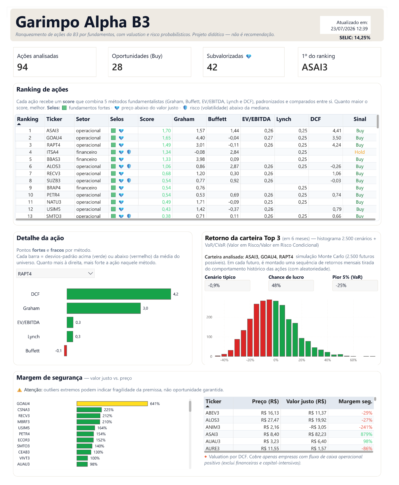
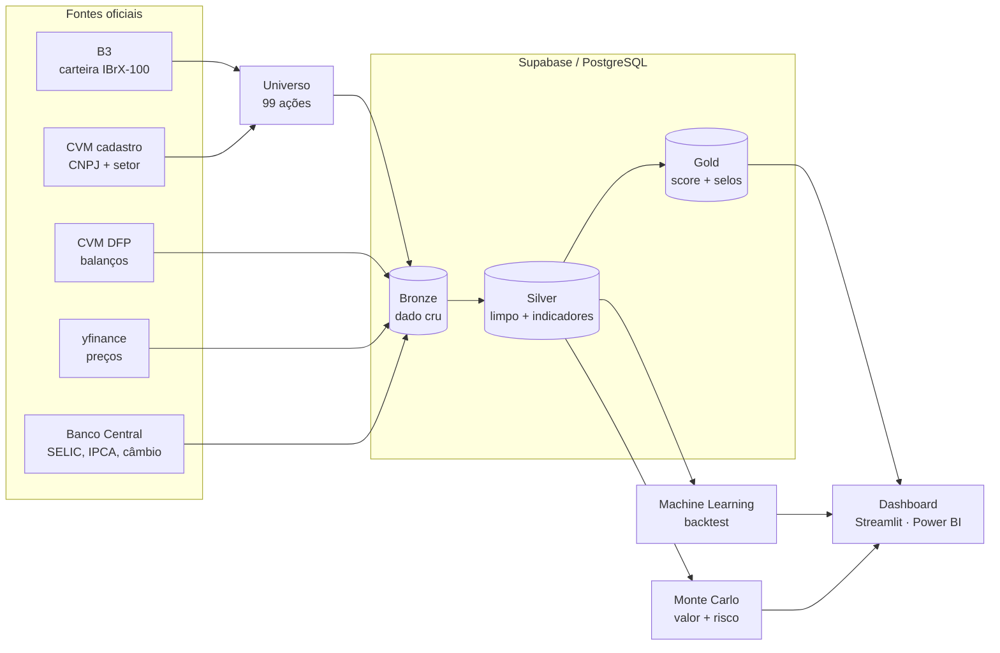

# Garimpo Alpha B3

> ⚠️ **Disclaimer:** projeto **educacional e de portfólio**. Não constitui recomendação de
> investimento. Resultados passados não garantem resultados futuros.



## O que é, em uma frase

A B3 tem centenas de ações — **olhar uma a uma é inviável**. O **Garimpo Alpha B3** lê os
dados oficiais das **99 ações do IBrX-100** (as mais líquidas da bolsa) e entrega um
**ranking objetivo** que responde três
perguntas que todo investidor faz: a ação é **barata**? a empresa é **boa**? e **qual o
risco**? Tudo de forma transparente — dá para ver exatamente como cada número foi calculado.

> Em termos técnicos: um pipeline de dados *end-to-end* que combina **análise
> fundamentalista**, **machine learning** e **simulação de Monte Carlo**, com um dashboard
> interativo. Foi construído para demonstrar, num produto único, as competências de
> **Engenheiro**, **Cientista** e **Analista de Dados**.

---

## Como funciona (em linguagem simples)

O projeto organiza os dados em três níveis (arquitetura **Medallion**, padrão de mercado):

| Nível | O que é | Analogia |
|---|---|---|
| **Bronze** | Dado cru, exatamente como veio da fonte | a matéria-prima |
| **Silver** | Dado limpo e com indicadores calculados (lucro, dívida, margens…) | a matéria beneficiada |
| **Gold** | O produto final: score, ranking e selos | o produto na prateleira |

Sobre essa base, três camadas de análise:

1. **Fundamentos (vale a pena?)** — 5 métodos clássicos (Graham, Buffett, EV/EBITDA, Lynch,
   DCF) viram um **score único** comparável entre as ações.
2. **Machine Learning (dá para prever?)** — um modelo tenta prever se a ação supera o
   Ibovespa. *Spoiler honesto:* quase não dá (e isso é esperado — explico abaixo).
3. **Monte Carlo (qual o risco?)** — em vez de um número único, roda **2.500 cenários**
   variando as premissas incertas (crescimento dos lucros, taxa de juros). Para uma ação,
   gera a **distribuição do valor justo** (e a chance de estar barata); para a carteira, a
   **distribuição de retornos** em 6 meses — de onde sai o risco no pior caso (**VaR/CVaR**).



### As três camadas em detalhe (e o Supabase)

Todo o pipeline vive num **[Supabase](https://supabase.com/) (PostgreSQL gerenciado na
nuvem)** — é o banco onde as três camadas Medallion são gravadas e de onde o dashboard lê.
A conexão é feita pelo **SESSION pooler (porta 5432)**, configurada via `.env` (ver
[`.env.example`](.env.example); credenciais nunca são versionadas).

| Camada | Tabelas | O que **vem cru** | O que **de fato usamos** |
|---|---|---|---|
| **Bronze** | `bronze_cvm_dre`, `bronze_cvm_bpp`, `bronze_cvm_bpa`, `bronze_cvm_dfc`, `bronze_cvm_acoes`, `bronze_prices` | A DFP da CVM traz o **plano de contas inteiro** (centenas de linhas por empresa/ano) + metadados (versão, escala, data de divulgação); os preços trazem OHLCV diário | Só as **contas-chave**: lucro (3.11), patrimônio líquido, receita (3.01), EBIT (3.05), caixa (1.01.01), fluxo operacional (6.01) e D&A; dos preços, o **fechamento ajustado** |
| **Silver** | `silver_fundamentals` | — | **Limpeza + indicadores derivados**: dedup do exercício (último + versão mais recente), LPA/VPA por **descrição de conta** (o código muda entre empresas), EBITDA, dívida líquida, e as **normalizações de escala** (UNIDADE→MIL; nº de ações ancorado no free-float) |
| **Gold** | `gold_fundamental_scores`, `gold_montecarlo_valuation`, `gold_montecarlo_carteira`, `gold_montecarlo_carteira_resumo`, `meta_pipeline` | — | **O produto pronto**: score composto + ranking + selos + `setor_economico`; distribuições do Monte Carlo; e o `meta_pipeline` (data da última atualização, SELIC, nº de ações) que alimenta o topo do dashboard |

### De onde vêm os dados (6 fontes oficiais)

| Fonte | O que é | O que extraímos |
|---|---|---|
| **B3** ([sistemaswebb3-listados.b3.com.br](https://sistemaswebb3-listados.b3.com.br/indexPage/day/IBXX?language=pt-br)) | Bolsa brasileira; carteira do dia do índice **IBrX-100** | A **lista de tickers** do universo + o **free float** de cada ação (âncora de escala) |
| **CVM — Cadastro** ([cad_cia_aberta.csv](https://dados.cvm.gov.br/dados/CIA_ABERTA/CAD/DADOS/cad_cia_aberta.csv)) | Cadastro de companhias abertas | **CNPJ** (chave da CVM) e **setor de atividade** (`SETOR_ATIV`) de cada empresa |
| **CVM — DFP** (dados.cvm.gov.br) | Órgão regulador; portal de **Dados Abertos** do governo | Demonstrações financeiras: balanço, DRE (resultado) e fluxo de caixa — **com a data de divulgação** (essencial para o *point-in-time*) |
| **yfinance** | Biblioteca que lê o **Yahoo Finance** | Preços históricos diários **ajustados** (desde 2012) + o **Ibovespa** (índice da bolsa) |
| **brapi** (brapi.dev) | API de mercado da B3 | Cotação corrente (fallback) |
| **BCB/SGS** | **Banco Central** — Sistema Gerenciador de Séries | **SELIC** (juros), **IPCA** (inflação) e **câmbio** USD/BRL |

### O universo: IBrX-100 e os dois tipos de "setor"

O universo analisado são as **99 ações do IBrX-100** (o índice das mais líquidas da B3). Ele
**não é hardcoded**: a lista de tickers vem da **carteira oficial da B3** e cada CNPJ é
resolvido no **cadastro da CVM** — tudo rastreável à fonte, com a **data da carteira**
registrada no arquivo [`data/universo_ibrx100.csv`](data/universo_ibrx100.csv). O script
[`scripts/build_universo.py`](scripts/build_universo.py) reproduz esse arquivo.

Cada ação carrega **dois campos de setor com papéis diferentes** — e essa distinção é chave:

- **`setor` (metodológico): `operacional` ou `financeiro`.** Decide *quais métodos se
  aplicam*. Bancos, seguradoras e holdings financeiras **não têm EV/EBITDA nem fluxo de caixa
  para DCF** no sentido tradicional, então recebem **3 métodos** (Graham, Buffett, Lynch) em
  vez de 5 — com os pesos renormalizados. Não é gambiarra: é reconhecer que valuation de banco
  ≠ valuation de indústria. *(Casos de fronteira decididos à mão: B3SA3 = operacional, pois
  tem EBITDA real; BRAP4 = financeiro, por ser holding pura.)*
- **`setor_economico` (~11 setores): Financeiro, Utilidade Pública, Consumo Cíclico, Materiais
  Básicos, Saúde…** É só **vitrine/diversificação** — não muda o score. Serve para mostrar que
  o garimpo cobre **a economia toda**, e não apenas "operacional vs financeiro".

> Os dois campos podem **discordar de propósito**: a BRAP4 é `financeiro` (metodológico, por
> ser holding) mas `Materiais Básicos` (econômico, pois sua exposição é a Vale). Isso é
> intencional — cada campo responde a uma pergunta diferente.

### Os 5 métodos fundamentalistas (glossário)

| Método | Significado | O que mede |
|---|---|---|
| **Graham** | Valor intrínseco de Benjamin Graham: √(22,5 × LPA × VPA) | Se o preço está abaixo de um "valor de barganha" |
| **Buffett** | Qualidade do negócio (ROE = retorno sobre patrimônio, margem líquida) | Se a empresa é **boa e consistente** |
| **EV/EBITDA** | **EV** = valor da empresa (mercado + dívida líquida); **EBITDA** = lucro operacional antes de juros, impostos, depreciação e amortização | Quão **cara** é a geração de caixa (menor = mais barata) |
| **Lynch** | Peter Lynch: **PEG** = (Preço/Lucro) ÷ crescimento dos lucros | **Crescimento a preço razoável** (menor = melhor) |
| **DCF** | **Discounted Cash Flow** (Fluxo de Caixa Descontado) | Projeta o caixa futuro e traz a valor presente → **valor justo** |

---

## O que cada papel fez aqui (vs. o mercado)

Este projeto foi desenhado para mostrar, na prática, as três funções de uma equipe de dados.

### 🔧 Engenheiro de Dados
*No mercado:* constrói e mantém os **pipelines** que levam dados de várias fontes até um
formato confiável e analisável — garantindo qualidade, reprodutibilidade e automação.

*Neste projeto:*
- **Ingestão de 6 fontes heterogêneas** (B3 e CVM DFP/cadastro por CSV; yfinance/brapi/BCB por API).
- **Arquitetura Medallion** (Bronze→Silver→Gold) no **Supabase/PostgreSQL**.
- **Dado *point-in-time*:** usa a *data de divulgação* oficial (CVM `DT_RECEB`) para nunca
  "olhar o futuro" — o erro nº 1 em projetos financeiros.
- **Robustez do mundo real:** retry/lotes para a instabilidade do yfinance; normalização de
  inconsistências da CVM (unidades do nº de ações; plano de contas que muda por setor).
- **Reprodutibilidade e CI:** um comando roda o pipeline inteiro; testes + lint a cada push.

### 🔬 Cientista de Dados
*No mercado:* formula hipóteses, cria *features*, treina e **valida modelos com rigor
estatístico**, e comunica a incerteza com honestidade.

*Neste projeto:*
- **Dataset *point-in-time*** (junção pela data de divulgação) — sem vazamento de informação.
- **Validação temporal *walk-forward* com embargo** (nunca *k-fold* aleatório) — o critério
  de qualidade nº 1 em ML financeiro.
- **3 algoritmos de árvore de decisão** comparados: **Random Forest** (várias árvores
  "votando"), **XGBoost** e **LightGBM** (árvores sequenciais que corrigem o erro da
  anterior — os mais usados em competições). **Métrica honesta** (AUC ~0,50): a ausência de
  "acurácia mágica" é a **prova de que não há vazamento**.
- **Simulação de Monte Carlo** (2.500 cenários) para valor justo e risco (VaR/CVaR).
- **Backtest** da estratégia contra o Ibovespa desde 2013.

### 📊 Analista de Dados
*No mercado:* transforma números em **decisão** — com storytelling, dashboards claros e
comunicação para quem não é técnico.

*Neste projeto:*
- **Score interpretável** (z-score com pesos explícitos), não uma caixa-preta.
- **Selos de negócio:** ✅ fundamentos fortes · 💎 subvalorizada · 🛡️ risco baixo.
- **Dois dashboards** sobre a mesma base Gold: **Streamlit** (interativo, protagonista) e um
  showcase em **Power BI** ([`garimpo-alpha-b3.pbix`](garimpo-alpha-b3.pbix) versionado) —
  ambos com storytelling do macro ao específico e **explicação didática em cada gráfico**.
- **Comunicação honesta das limitações** (abaixo) — maturidade que vale mais que número bonito.

---

## Resultados (reais e honestos)

**O teste (backtest):** voltamos a **2013** e, a cada 6 meses, "compramos" no simulador as
**3 melhores** do ranking — e, só para comparar, as **3 piores**. Medimos o resultado de cada
carteira ao longo de ~12 anos, sempre contra o **Ibovespa** (o índice da bolsa, nosso
referencial). A pergunta: *o ranking realmente separa boas de más ações?*

| Carteira | Retorno acumulado | Sharpe (retorno/risco) | Pior queda | Acerto vs IBOV |
|---|--:|--:|--:|--:|
| **Melhores (top do ranking)** | **+1000%** | **0,85** | **−10%** | **73%** |
| Piores (fundo do ranking) | −12% | 0,16 | −77% | — |
| Ibovespa (referência) | +203% | 0,50 | −28% | — |

> **Conclusão:** as "melhores" do ranking renderam **muito mais** que as "piores" (+1000% vs
> −12%) e que o índice, com **menos risco** (Sharpe maior, queda menor) e acertando 73% dos
> períodos. Isso mostra que o score **separa joio de trigo** — é o principal resultado do
> projeto. ⚠️ Os **números absolutos** são otimistas por *survivorship bias* (usamos os
> sobreviventes de hoje — ver [Limitações](#limitações-honestas)); por isso o que importa é o
> **contraste** entre melhores e piores, não o "+1000%" isolado.

- **Monte Carlo:** afirmações probabilísticas, ex.: *"PETR4 tem ~100% de chance de estar
  subvalorizada"*.
- **ML honesto:** prever "bater o índice" deu ~aleatório (AUC ~0,50) — **esperado**, e a
  validação limpa é justamente o que comprova o rigor. O valor está no **processo**.

---

## Limitações honestas

Transparência faz parte da entrega:

- **Survivorship bias:** o universo são as **99 ações do IBrX-100 de hoje** aplicadas a todo o
  histórico — isso infla os retornos absolutos do backtest (empresas que quebraram não estão
  na amostra). O contraste melhores-vs-piores segue válido.
- **Universo não é *point-in-time*:** o ideal (escolher as ações como eram em cada data)
  está documentado mas não implementado (ver `docs/02-decisoes-adr.md`).
- **Cobertura do valuation por DCF:** o bloco "Preço × Valor justo" cobre ~70 das 94 ações do
  ranking — **só onde o DCF faz sentido**. Ficam de fora as financeiras (por método) e
  empresas de fluxo de caixa operacional negativo/errático (construtoras, aluguel de frota,
  reestruturação). Mostrar um "valor justo" delas seria pior que omitir.
- **ML sem poder preditivo:** com este universo e *features*, prever o índice é ~aleatório —
  honesto e esperado; o produto não depende disso.
- **DCF para bancos/holdings:** simplificado; valuation por fluxo de caixa não se aplica bem
  a eles (tratados à parte, com 3 métodos).

### Notas de qualidade de dados (para quem for estender)

A CVM é oficial, mas tem armadilhas que o pipeline já trata — vale saber antes de mexer:

- **Plano de contas resolvido por *descrição*, não por código:** o código de uma mesma conta
  (ex.: lucro líquido) **muda entre empresas** (e até entre bancos). Casamos pela descrição.
- **Escala da moeda (`ESCALA_MOEDA`):** algumas empresas reportam em **UNIDADE**, não em MIL
  (ex.: VIVA3) — sem normalizar, o lucro/patrimônio fica **1000× inflado**.
- **Número de ações sem escala:** a CVM não indica se o total está em unidades ou milhares, e
  as magnitudes se sobrepõem. Ancoramos no **free float da carteira B3** para decidir.
- **`composicao_capital` só existe a partir de 2020** → LPA/VPA ficam nulos antes disso.

---

## Como rodar

Pré-requisito: [`uv`](https://docs.astral.sh/uv/).

```bash
# 1. ambiente + dependências
uv venv
uv sync --extra dev --extra ingestion --extra ml --extra dashboard

# 2. credenciais do Supabase (preencha o .env; nunca é versionado)
cp .env.example .env

# 3. ATUALIZAR OS DADOS — roda o pipeline fim-a-fim (Bronze→Silver→Gold→dataset ML)
uv run python scripts/run_pipeline.py

# 4. VER O PAINEL — lê o que já está no banco (não reprocessa)
uv run streamlit run dashboard/app.py        # http://localhost:8501
```

- **Atualizar dados:** rode o `run_pipeline` (passo 3) — único comando necessário; a "última
  atualização" no topo do dashboard reflete essa execução. As tabelas do Supabase usam
  `if_exists="replace"`, então cada execução **reconstrói** a Gold a partir das fontes.
- **Só consultar:** rode o `streamlit` (passo 4). Alternativamente, abra o showcase em
  **Power BI** (`garimpo-alpha-b3.pbix`) e clique em **Atualizar** para puxar a Gold do Supabase.
- Análises avulsas: `run_backtest.py`, `run_montecarlo.py`. Testes/lint: `uv run pytest -q`,
  `uv run ruff check .`.

### Atualizar o universo (a cada quadrimestre)

O IBrX-100 é **rebalanceado pela B3 a cada quadrimestre**, então a lista de ações muda algumas
vezes por ano. Para atualizar:

```bash
# 1. baixe a carteira do dia do IBrX-100 no site da B3 e salve em:
#    data/raw/b3/ibrx100.csv
# 2. regenere o universo (resolve CNPJ + setor pelas fontes oficiais):
uv run python scripts/build_universo.py
# 3. reprocesse tudo com o novo universo:
uv run python scripts/run_pipeline.py
```

**Por que assim:** o `build_universo.py` **preserva os CNPJs já verificados** (o CNPJ é um
fato estável) e só tenta resolver por nome os **tickers novos**, imprimindo-os como
`[CONFERIR]` — nunca confia num casamento automático em silêncio. Assim a atualização é
reproduzível e segura, sem reintroduzir erros de identificação.

> Em ambientes com **Windows Smart App Control**, o `uv run` pode ser bloqueado (erro 4551) —
> recrie o ambiente (`uv venv --clear && uv sync …`) ou reinicie a máquina.

---

## Stack

**Implementado:** Python 3.11 · `uv` · Supabase/PostgreSQL (Medallion) · SQLAlchemy ·
pandas/NumPy/SciPy · scikit-learn / XGBoost / LightGBM · yfinance · brapi · `python-bcb` ·
Streamlit + Plotly · **Power BI** (showcase) · pytest · ruff · GitHub Actions (CI).

**Roadmap (ver seção abaixo):** agendamento automático, Pandera, Docker, dbt.

## Roadmap

- **Agendamento automático** do pipeline (GitHub Actions) — dados se atualizando sozinhos.
- **Qualidade de dados** com Pandera (validação de schemas/regras).
- **Docker** para reprodutibilidade (`docker compose up`).
- Filtro de liquidez *point-in-time* (elimina o survivorship — o universo IBrX-100 já está
  implementado; falta reconstruí-lo como era em cada data do histórico).

## Estrutura e documentação

```
ingestion/  extratores (cvm, precos, bcb) → Bronze
src/        universo.py (carrega o IBrX-100) · fundamental/ (5 métodos + score + selos) · ml/ · montecarlo/ · backtest.py
scripts/    run_pipeline · build_universo (reproduz o universo) · etapas individuais
dashboard/  app Streamlit
data/       universo_ibrx100.csv (curado e versionado; o resto é cache local ignorado)
tests/      ~41 testes
docs/       spike de viabilidade · ADRs · dicionário de dados
```

- [`PRD.md`](PRD.md) — especificação/visão original.
- [`docs/02-decisoes-adr.md`](docs/02-decisoes-adr.md) — decisões de arquitetura (ADRs).
- [`docs/03-dicionario-de-dados.md`](docs/03-dicionario-de-dados.md) — mapa CVM → indicadores.
